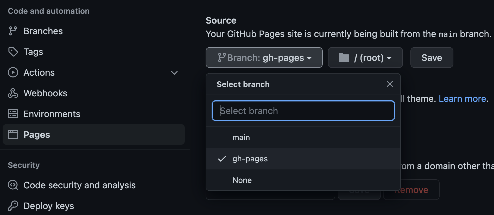

# My personal website

This project contains the source code of [my personal website](https://carlossanabriam.github.io/),
developed with [Hugo](https://gohugo.io/) (using the [Hugo Profile theme](https://themes.gohugo.io/themes/hugo-profile/))
and deployed using [GitHub Pages](https://pages.github.com/).

The following sections explain in detail how this website was developed and deployed (completely free of charge).

## 1. Create the GitHub repository and clone it
Follow the instructions on [GitHub Pages](https://pages.github.com/).

After that, you should be able to browse your website at https://username.github.io,
which should show a simple `Hello World` message.

> If your username contains uppercase characters, you can put them in lowercase in the project name if you want.

## 2. Add .gitignore and README files
Copy the ones in this project. Commit them afterwards.

## 3. Install Hugo
Follow the instructions on [Install Hugo](https://gohugo.io/getting-started/installing/).

Test the Hugo installation with the following command:
```bash
hugo help
```

The output you see in your console should be similar to the following:
```
hugo is the main command, used to build your Hugo site.

Hugo is a Fast and Flexible Static Site Generator
built with love by spf13 and friends in Go.

...
```

## 4. Add a new GitHub Action to build the source code using Hugo
Now we will configure a GitHub Action to pull the source code content from the `main` branch, build it,
and then commit the generated content to the `gh-pages` branch.

We will follow the instructions on the [Hugo Host on GitHub](https://gohugo.io/hosting-and-deployment/hosting-on-github/) documentation.

This is a clean setup as your Hugo files are stored in one branch and your generated files are published into a separate branch.

Copy the file `.github/workflows/gh-pages.yml` from the current repo, and paste it in your repo in the same path.
This file contains the code for our new GitHub Action.

Commit the changes and push them.

This will launch the execution of the following 2 GitHub Actions:
1. `github pages`: The one you have just added, that will take the code from the `main` branch, build it using Hugo,
   and push it to the `gh-pages` branch.
2. `pages-build-deployment`: The one that was automatically added by GitHub when you created the GitHub Pages repo.
   It will pull the content from the `gh-pages` branch (after configuring it in step 5), compress it to a tar file, 
   upload the artifact, and deploy it to GitHub Pages.

After pushing the `.github/workflows/gh-pages.yml` file, the `gh-pages` branch will be created,
but the `github pages` GitHub Action will fail, because we still haven't uploaded the Hugo project source code.
We will do this later. We follow this order to let the GitHub Action create the `gh-pages` branch without the need
to specify a source branch for it.

## 5. Configure GitHub Pages to deploy the content on the `gh-pages` branch
By default, GitHub Pages uses the following branch structure:
* The `gh-pages` branch is used to store the source code
* The `main` branch is used to store the website generated files, which are deployed to GitHub Pages

The new GitHub Action we have added swaps the purpose of these 2 branches:
* The `main` branch will be used to store the source code
* The `gh-pages` branch will be used to store the website generated files

Therefore, we need to tell GitHub Pages to deploy the code inside the `gh-pages` branch instead of using the `main` branch.

To change this setting, go to `Settings > Pages`, change the source branch to `gh-pages` and click `Save`.



## 6. Initialize the Hugo project and include the Hugo Profile theme
Execute the following commands on a terminal:
```bash
cd <project-folder>
hugo new site . -f=yaml --force
git submodule add https://github.com/CarlosSanabriaM/hugo-profile.git themes/hugo-profile
```

This will create the Hugo project structure inside your repo,
and add the Hugo Profile theme as a [Git submodule](https://git-scm.com/book/en/v2/Git-Tools-Submodules).

## 7. Modify the website content and preview it locally
In order to do that, you need to:
* Modify the `config.yaml` file (you can use the one in this repo or the
  [official example](https://github.com/CarlosSanabriaM/hugo-profile/blob/master/exampleSite/config.yaml) as reference)
* Load content to the `static` folder
    * `fav.png`: [favicon icon](https://en.wikipedia.org/wiki/Favicon)
    * `images/hero.png` or `images/hero.svg`: profile picture
        * Make sure the `params.hero.image` value inside `config.yaml` uses the same extension as the file you loaded
          (`.png`, `.svg`, ...)

To preview your website locally, execute the following commands on a terminal:
```bash
cd <project-folder>
hugo server -D
```

You can access the website in your browser at http://localhost:1313/.

All changes made to the website source code will be dynamically updated in the browser.
However, for some changes you might need to force refresh your web browser to clear cached content such as images 
(something like `Ctrl-R` on Windows or `Cmd-Shift-R` on Mac usually works).

## 8. Commit and push the source code, and finally deploy our website
First, remove the `index.html` file you created in step 1, because you won't need it anymore. 

After that, commit all the changes made to the source code and push them.

This will launch the execution of the 2 GitHub Actions as explained above, but this time none of them will fail,
and our website will be deployed to our GitHub Pages url.

After both actions have finished, we should be able to browse our website at https://username.github.io.

## 9. Next steps
With our Continuous Deployment pipeline already set up, we can make changes to the website source code and deploy them
by simply pushing the changes to the `main` branch.

## How to update the Git submodule of the Hugo Profile theme
This will update the Hugo Profile theme to its latest version:
```shell
git submodule update --remote --merge
```

__Happy coding! :)__

## References
* [Hugo Install](https://gohugo.io/getting-started/installing/)
* [Hugo QuickStart](https://gohugo.io/getting-started/quick-start/)
* [Hugo Profile theme](https://themes.gohugo.io/themes/hugo-profile/)
* [Hugo Profile theme config reference](https://github.com/CarlosSanabriaM/hugo-profile/blob/master/exampleSite/config.yaml)
* [Hugo Host on GitHub](https://gohugo.io/hosting-and-deployment/hosting-on-github/)
* [GitHub Pages](https://pages.github.com/)
* [Git Submodules](https://git-scm.com/book/en/v2/Git-Tools-Submodules)
